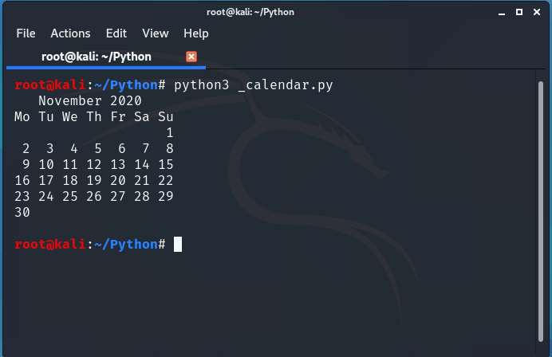

# Display calender using python\
\
\

## Modules used :: calender
\
\

 
 
 1) For Windows : 'python -m pip install calendra'   [yes it is "calendra"]
 .
 .
 .
 2) For Linux   : pip3 install calendra
 
 
 
#### About the code : Change values of yy and mm to get required year and month calendar respectively!!!
\
\
\

### For more repositories visit [here](https://github.com/chinmay29hub/ "For more")

.
.
.
.
.
\
\
##    OUTPUT::::::::::::: 

   
   
   
   
     
 
 
